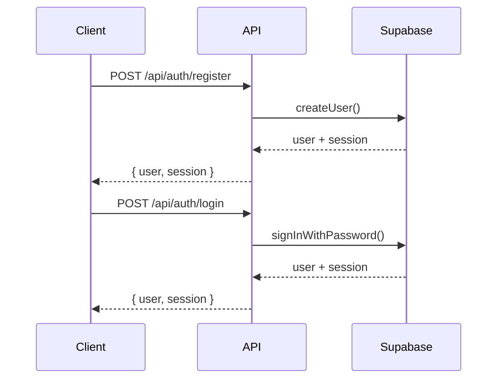

# Authentication API

## Overview

The Authentication API handles user registration, login, logout, and password management using Supabase Auth with JWT tokens.

## Authentication Flow



## Endpoints

### Register User

```http
POST /api/auth/register
```

Create a new user account.

#### Request Body

```typescript
interface RegisterRequest {
  email: string;
  password: string;
  firstName: string;
  lastName: string;
  phone?: string;
}
```

#### Validation Rules

- `email`: Valid email format, unique
- `password`: Minimum 8 characters, must include letter and number
- `firstName`: 2-50 characters
- `lastName`: 2-50 characters
- `phone`: Optional, valid phone format

#### Response

```typescript
interface RegisterResponse {
  success: true;
  data: {
    user: {
      id: string;
      email: string;
      firstName: string;
      lastName: string;
      emailConfirmed: boolean;
    };
    message: string;
  };
}
```

#### Example

```bash
curl -X POST "http://localhost:3000/api/auth/register" \
  -H "Content-Type: application/json" \
  -d '{
    "email": "user@example.com",
    "password": "password123",
    "firstName": "John",
    "lastName": "Doe",
    "phone": "+1234567890"
  }'
```

### Login User

```http
POST /api/auth/login
```

Authenticate user and create session.

#### Request Body

```typescript
interface LoginRequest {
  email: string;
  password: string;
  rememberMe?: boolean;
}
```

#### Response

```typescript
interface LoginResponse {
  success: true;
  data: {
    user: User;
    session: {
      accessToken: string;
      refreshToken: string;
      expiresAt: string;
    };
  };
}
```

#### Example

```bash
curl -X POST "http://localhost:3000/api/auth/login" \
  -H "Content-Type: application/json" \
  -d '{
    "email": "user@example.com",
    "password": "password123",
    "rememberMe": true
  }'
```

### Logout User

```http
POST /api/auth/logout
```

End user session and invalidate tokens.

#### Headers

```http
Authorization: Bearer <access-token>
```

#### Response

```typescript
interface LogoutResponse {
  success: true;
  message: "Logged out successfully";
}
```

#### Example

```bash
curl -X POST "http://localhost:3000/api/auth/logout" \
  -H "Authorization: Bearer your-access-token"
```

### Refresh Token

```http
POST /api/auth/refresh
```

Get new access token using refresh token.

#### Request Body

```typescript
interface RefreshRequest {
  refreshToken: string;
}
```

#### Response

```typescript
interface RefreshResponse {
  success: true;
  data: {
    accessToken: string;
    expiresAt: string;
  };
}
```

### Forgot Password

```http
POST /api/auth/forgot-password
```

Send password reset email to user.

#### Request Body

```typescript
interface ForgotPasswordRequest {
  email: string;
}
```

#### Response

```typescript
interface ForgotPasswordResponse {
  success: true;
  message: "Password reset email sent";
}
```

#### Example

```bash
curl -X POST "http://localhost:3000/api/auth/forgot-password" \
  -H "Content-Type: application/json" \
  -d '{
    "email": "user@example.com"
  }'
```

### Reset Password

```http
POST /api/auth/reset-password
```

Reset user password using reset token.

#### Request Body

```typescript
interface ResetPasswordRequest {
  token: string;
  password: string;
  confirmPassword: string;
}
```

#### Response

```typescript
interface ResetPasswordResponse {
  success: true;
  message: "Password reset successfully";
}
```

### Verify Email

```http
POST /api/auth/verify-email
```

Verify user email address using verification token.

#### Request Body

```typescript
interface VerifyEmailRequest {
  token: string;
}
```

#### Response

```typescript
interface VerifyEmailResponse {
  success: true;
  message: "Email verified successfully";
}
```

### Get Current User

```http
GET /api/auth/me
```

Get current authenticated user information.

#### Headers

```http
Authorization: Bearer <access-token>
```

#### Response

```typescript
interface MeResponse {
  success: true;
  data: {
    user: User;
  };
}
```

### Change Password

```http
POST /api/auth/change-password
```

Change password for authenticated user.

#### Headers

```http
Authorization: Bearer <access-token>
```

#### Request Body

```typescript
interface ChangePasswordRequest {
  currentPassword: string;
  newPassword: string;
  confirmPassword: string;
}
```

#### Response

```typescript
interface ChangePasswordResponse {
  success: true;
  message: "Password changed successfully";
}
```

## Data Models

### User

```typescript
interface User {
  id: string;
  email: string;
  firstName: string;
  lastName: string;
  phone?: string;
  dateOfBirth?: string;
  gender?: 'male' | 'female' | 'other';
  avatarUrl?: string;
  isVerified: boolean;
  isAdmin: boolean;
  createdAt: string;
  updatedAt: string;
}
```

### Session

```typescript
interface Session {
  accessToken: string;
  refreshToken: string;
  tokenType: 'Bearer';
  expiresAt: string;
  user: User;
}
```

## Error Responses

### 400 Bad Request

```json
{
  "success": false,
  "error": "Invalid email format"
}
```

### 401 Unauthorized

```json
{
  "success": false,
  "error": "Invalid credentials"
}
```

### 409 Conflict

```json
{
  "success": false,
  "error": "Email already exists"
}
```

### 422 Validation Error

```json
{
  "success": false,
  "error": "Validation failed",
  "details": [
    {
      "field": "password",
      "message": "Password must be at least 8 characters"
    }
  ]
}
```

### 429 Too Many Requests

```json
{
  "success": false,
  "error": "Too many login attempts. Please try again later."
}
```

## Security Features

### Password Requirements

- Minimum 8 characters
- At least one uppercase letter
- At least one lowercase letter
- At least one number
- At least one special character (optional but recommended)

### Rate Limiting

- Login attempts: 5 per minute per IP
- Registration: 3 per minute per IP
- Password reset: 1 per minute per email
- Refresh token: 10 per minute per user

### Session Management

- Access tokens expire in 1 hour
- Refresh tokens expire in 30 days
- Automatic token refresh on API calls
- Secure HTTP-only cookies for refresh tokens

### Security Headers

```http
Set-Cookie: refreshToken=...; HttpOnly; Secure; SameSite=Strict
X-Frame-Options: DENY
X-Content-Type-Options: nosniff
```

## Client-Side Integration

### React Hook Usage

```typescript
import { useAuth } from '@/hooks/use-auth';

function LoginForm() {
  const { login, register, isLoading, error } = useAuth();

  const handleLogin = async (credentials: LoginRequest) => {
    try {
      await login(credentials);
      // Redirect to dashboard
    } catch (error) {
      // Handle error
    }
  };

  return (
    <form onSubmit={handleLogin}>
      {/* Form fields */}
    </form>
  );
}
```

### Auth Context

```typescript
interface AuthContextValue {
  user: User | null;
  isLoading: boolean;
  isAuthenticated: boolean;
  login: (credentials: LoginRequest) => Promise<void>;
  register: (data: RegisterRequest) => Promise<void>;
  logout: () => Promise<void>;
  refreshToken: () => Promise<void>;
}

const AuthContext = createContext<AuthContextValue | null>(null);

export const useAuth = () => {
  const context = useContext(AuthContext);
  if (!context) {
    throw new Error('useAuth must be used within AuthProvider');
  }
  return context;
};
```

### Token Management

```typescript
// lib/auth/token-manager.ts
class TokenManager {
  private accessToken: string | null = null;
  private refreshToken: string | null = null;

  setTokens(access: string, refresh: string) {
    this.accessToken = access;
    this.refreshToken = refresh;
    
    // Store refresh token in secure cookie
    document.cookie = `refreshToken=${refresh}; HttpOnly; Secure; SameSite=Strict`;
  }

  getAccessToken(): string | null {
    return this.accessToken;
  }

  async refreshAccessToken(): Promise<string | null> {
    if (!this.refreshToken) return null;

    try {
      const response = await fetch('/api/auth/refresh', {
        method: 'POST',
        headers: { 'Content-Type': 'application/json' },
        body: JSON.stringify({ refreshToken: this.refreshToken }),
      });

      const data = await response.json();
      
      if (data.success) {
        this.accessToken = data.data.accessToken;
        return this.accessToken;
      }
    } catch (error) {
      console.error('Token refresh failed:', error);
    }

    return null;
  }

  clearTokens() {
    this.accessToken = null;
    this.refreshToken = null;
    document.cookie = 'refreshToken=; expires=Thu, 01 Jan 1970 00:00:00 UTC; path=/;';
  }
}

export const tokenManager = new TokenManager();
```

### API Interceptor

```typescript
// lib/api/interceptor.ts
import axios from 'axios';
import { tokenManager } from './token-manager';

const apiClient = axios.create({
  baseURL: '/api',
});

// Request interceptor
apiClient.interceptors.request.use((config) => {
  const token = tokenManager.getAccessToken();
  if (token) {
    config.headers.Authorization = `Bearer ${token}`;
  }
  return config;
});

// Response interceptor
apiClient.interceptors.response.use(
  (response) => response,
  async (error) => {
    if (error.response?.status === 401) {
      const newToken = await tokenManager.refreshAccessToken();
      
      if (newToken) {
        // Retry original request
        error.config.headers.Authorization = `Bearer ${newToken}`;
        return apiClient.request(error.config);
      } else {
        // Redirect to login
        window.location.href = '/login';
      }
    }
    
    return Promise.reject(error);
  }
);

export { apiClient };
```

## Testing

### Unit Tests

```typescript
// __tests__/auth.test.ts
import { POST } from '@/app/api/auth/login/route';
import { createMocks } from 'node-mocks-http';

describe('/api/auth/login', () => {
  it('should login user with valid credentials', async () => {
    const { req } = createMocks({
      method: 'POST',
      body: {
        email: 'test@example.com',
        password: 'password123',
      },
    });

    const response = await POST(req);
    const data = await response.json();

    expect(data.success).toBe(true);
    expect(data.data.user.email).toBe('test@example.com');
  });

  it('should reject invalid credentials', async () => {
    const { req } = createMocks({
      method: 'POST',
      body: {
        email: 'test@example.com',
        password: 'wrongpassword',
      },
    });

    const response = await POST(req);
    const data = await response.json();

    expect(data.success).toBe(false);
    expect(data.error).toBe('Invalid credentials');
  });
});
```

### Integration Tests

```typescript
// __tests__/auth-flow.test.ts
import { render, screen, fireEvent, waitFor } from '@testing-library/react';
import { AuthProvider } from '@/providers/auth-provider';
import { LoginForm } from '@/components/auth/login-form';

describe('Auth Flow', () => {
  it('should complete login flow', async () => {
    render(
      <AuthProvider>
        <LoginForm />
      </AuthProvider>
    );

    fireEvent.change(screen.getByLabelText('Email'), {
      target: { value: 'test@example.com' },
    });
    
    fireEvent.change(screen.getByLabelText('Password'), {
      target: { value: 'password123' },
    });

    fireEvent.click(screen.getByText('Login'));

    await waitFor(() => {
      expect(screen.getByText('Welcome back!')).toBeInTheDocument();
    });
  });
});
```

---

*For more detailed authentication examples, see the [Development Guide](../DEVELOPMENT.md).*
