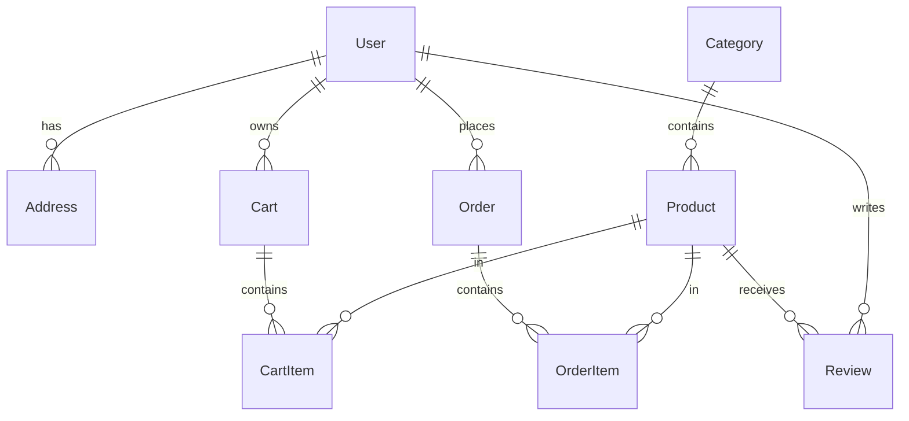

# Database Documentation

This directory contains comprehensive database documentation for VB Cart, covering schema design, migrations, and data management strategies.

## 📚 Documentation Overview

### Core Documentation
- **[Database Schema](./SCHEMA.md)** - Complete database structure, relationships, and data models
- **[Migration Guide](./MIGRATIONS.md)** - Database migration strategies and best practices
- **[Seeding Guide](./SEEDING.md)** - Initial data setup and test data generation

## 🗄️ Database Architecture

VB Cart uses **PostgreSQL** with **Supabase** as the database provider, featuring:

- **Scalable Schema**: Designed for e-commerce with proper indexing
- **Row Level Security (RLS)**: Secure data access policies
- **Real-time Subscriptions**: Live updates for cart and orders
- **Automated Backups**: Daily backups with point-in-time recovery
- **Performance Optimization**: Optimized queries and caching strategies

## 🏗️ Database Structure

### Core Tables

| Table | Purpose | Key Features |
|-------|---------|--------------|
| `User` | User accounts and profiles | Authentication, roles, preferences |
| `Product` | Product catalog | Variants, inventory, SEO optimization |
| `Category` | Product categorization | Hierarchical structure, SEO-friendly |
| `Cart` | Shopping cart management | Real-time sync, guest support |
| `Order` | Order processing | Status tracking, payment integration |
| `Review` | Product reviews | Ratings, verification, moderation |
| `Address` | User addresses | Multiple addresses, validation |

### Relationships



## 🔐 Security Features

### Row Level Security (RLS)
- **User Data**: Users can only access their own data
- **Cart Security**: Cart items are isolated by user
- **Order Privacy**: Orders are private to the customer
- **Admin Access**: Controlled admin privileges

### Data Validation
- **Input Sanitization**: All inputs are validated and sanitized
- **Type Safety**: TypeScript types generated from schema
- **Constraint Enforcement**: Database-level constraints for data integrity

## 📊 Performance Optimizations

### Indexing Strategy
- **Primary Keys**: Auto-incremented integers for fast joins
- **Foreign Keys**: Proper indexing on all foreign key relationships
- **Search Optimization**: Full-text search indexes for products
- **Composite Indexes**: Optimized for common query patterns

### Query Optimization
- **Selective Queries**: Only fetch required columns
- **Efficient Joins**: Optimized JOIN operations
- **Pagination**: Cursor-based pagination for large datasets
- **Caching**: Query result caching with appropriate TTL

## 🛠️ Development Tools

### Supabase CLI Commands
```bash
# Generate TypeScript types
npm run supabase:gen-types

# Create new migration
supabase migration new migration_name

# Apply migrations
supabase db push

# Reset database (development)
supabase db reset

# Open Supabase Studio
supabase start
```

### Database Studio
Access the visual database editor at: `http://localhost:54323`

## 🔄 Migration Strategy

### Development Workflow
1. **Schema Changes**: Create migration files for any schema changes
2. **Type Generation**: Run `npm run supabase:gen-types` after schema changes
3. **Testing**: Test migrations on local database first
4. **Review**: Code review for all migration files
5. **Deployment**: Apply migrations to production

### Best Practices
- **Backwards Compatibility**: Ensure migrations don't break existing code
- **Data Safety**: Always backup before running migrations
- **Incremental Changes**: Small, focused migrations over large ones
- **Rollback Plan**: Prepare rollback procedures for critical migrations

## 📝 Data Models

### TypeScript Integration
All database types are automatically generated and available in:
```typescript
import type { Database } from '@/types/db';

type Product = Database['public']['Tables']['Product']['Row'];
type User = Database['public']['Tables']['User']['Row'];
```

### Schema Validation
Runtime validation using Zod schemas aligned with database structure:
```typescript
import { createProductSchema } from '@/lib/validations/product';

const product = createProductSchema.parse(input);
```

## 🔍 Monitoring and Maintenance

### Health Checks
- **Connection Monitoring**: Regular health checks
- **Performance Metrics**: Query performance tracking
- **Error Logging**: Comprehensive error logging
- **Backup Verification**: Automated backup testing

### Maintenance Tasks
- **Statistics Update**: Regular ANALYZE commands
- **Index Maintenance**: Monitor and optimize indexes
- **Data Cleanup**: Remove expired sessions and temporary data
- **Performance Review**: Regular query performance analysis

## 🚀 Quick Start

### Setup Database
```bash
# Install Supabase CLI
npm install -g supabase

# Initialize project
supabase init

# Start local development
supabase start

# Link to remote project
supabase link --project-ref your-project-ref

# Generate types
npm run supabase:gen-types
```

### Environment Configuration
```env
# Database Configuration
NEXT_PUBLIC_SUPABASE_URL=your-supabase-url
NEXT_PUBLIC_SUPABASE_ANON_KEY=your-anon-key
SUPABASE_SERVICE_ROLE_KEY=your-service-role-key
DATABASE_URL=your-database-url
```

## 📚 Related Documentation

- **[API Documentation](../API/README.md)** - Database interactions via API
- **[Development Guide](../DEVELOPMENT.md)** - Development workflow
- **[Deployment Guide](../DEPLOYMENT.md)** - Production database setup

## 🔧 Troubleshooting

### Common Issues

1. **Connection Errors**
   - Verify environment variables
   - Check network connectivity
   - Validate credentials

2. **Migration Failures**
   - Check migration syntax
   - Verify permissions
   - Review dependencies

3. **Performance Issues**
   - Analyze slow queries
   - Check index usage
   - Monitor connection pool

### Support Resources
- [Supabase Documentation](https://supabase.com/docs)
- [PostgreSQL Documentation](https://www.postgresql.org/docs/)
- [Project Issues](https://github.com/hp1234v/vbcart/issues)

---

*Comprehensive database documentation for VB Cart e-commerce platform.*
