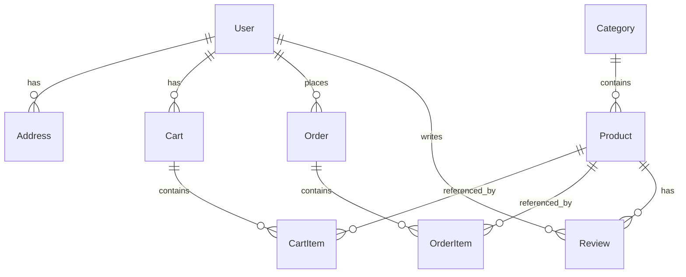

# Database Schema

## Overview

VB Cart uses PostgreSQL with Supabase as the database provider. The schema is designed for scalability and performance with proper indexing and relationships.

## Database Configuration

- **Provider**: Supabase (PostgreSQL)
- **Version**: PostgreSQL 13+
- **Authentication**: Supabase Auth
- **Real-time**: Enabled for cart and order updates

## Schema Overview



## Tables

### User

Stores user account information and authentication data.

```sql
CREATE TABLE "User" (
  id SERIAL PRIMARY KEY,
  email VARCHAR(255) UNIQUE NOT NULL,
  password_hash VARCHAR(255) NOT NULL,
  first_name VARCHAR(100) NOT NULL,
  last_name VARCHAR(100) NOT NULL,
  phone VARCHAR(20),
  date_of_birth DATE,
  gender VARCHAR(10),
  is_verified BOOLEAN DEFAULT false,
  is_admin BOOLEAN DEFAULT false,
  avatar_url VARCHAR(500),
  created_at TIMESTAMP DEFAULT CURRENT_TIMESTAMP,
  updated_at TIMESTAMP DEFAULT CURRENT_TIMESTAMP
);

-- Indexes
CREATE INDEX idx_user_email ON "User"(email);
CREATE INDEX idx_user_created_at ON "User"(created_at);
```

**Fields:**
- `id` - Primary key
- `email` - Unique email address
- `password_hash` - Hashed password (bcrypt)
- `first_name`, `last_name` - User's name
- `phone` - Contact number
- `date_of_birth` - Optional birth date
- `gender` - Optional gender
- `is_verified` - Email verification status
- `is_admin` - Admin privileges flag
- `avatar_url` - Profile picture URL
- `created_at`, `updated_at` - Timestamps

### Address

Stores user shipping and billing addresses.

```sql
CREATE TABLE "Address" (
  id SERIAL PRIMARY KEY,
  user_id INTEGER REFERENCES "User"(id) ON DELETE CASCADE,
  name VARCHAR(100) NOT NULL,
  phone VARCHAR(20) NOT NULL,
  street VARCHAR(255) NOT NULL,
  city VARCHAR(100) NOT NULL,
  state VARCHAR(100) NOT NULL,
  zip_code VARCHAR(20) NOT NULL,
  country VARCHAR(100) NOT NULL DEFAULT 'India',
  is_default BOOLEAN DEFAULT false,
  created_at TIMESTAMP DEFAULT CURRENT_TIMESTAMP,
  updated_at TIMESTAMP DEFAULT CURRENT_TIMESTAMP
);

-- Indexes
CREATE INDEX idx_address_user_id ON "Address"(user_id);
CREATE INDEX idx_address_is_default ON "Address"(user_id, is_default);
```

### Category

Product categories for organization and filtering.

```sql
CREATE TABLE "Category" (
  id SERIAL PRIMARY KEY,
  name VARCHAR(100) UNIQUE NOT NULL,
  slug VARCHAR(100) UNIQUE NOT NULL,
  description TEXT,
  image_url VARCHAR(500),
  is_active BOOLEAN DEFAULT true,
  sort_order INTEGER DEFAULT 0,
  created_at TIMESTAMP DEFAULT CURRENT_TIMESTAMP,
  updated_at TIMESTAMP DEFAULT CURRENT_TIMESTAMP
);

-- Indexes
CREATE INDEX idx_category_slug ON "Category"(slug);
CREATE INDEX idx_category_is_active ON "Category"(is_active);
CREATE INDEX idx_category_sort_order ON "Category"(sort_order);
```

### Product

Core product information and inventory.

```sql
CREATE TABLE "Product" (
  id SERIAL PRIMARY KEY,
  name VARCHAR(255) NOT NULL,
  slug VARCHAR(255) UNIQUE NOT NULL,
  description TEXT,
  short_description VARCHAR(500),
  price DECIMAL(10,2) NOT NULL,
  original_price DECIMAL(10,2),
  category_id INTEGER REFERENCES "Category"(id),
  image_url VARCHAR(500) NOT NULL,
  images TEXT[], -- Array of image URLs
  sizes TEXT[], -- Available sizes
  colors TEXT[], -- Available colors
  tags TEXT[], -- Product tags
  stock_quantity INTEGER DEFAULT 0,
  in_stock BOOLEAN GENERATED ALWAYS AS (stock_quantity > 0) STORED,
  is_featured BOOLEAN DEFAULT false,
  is_new BOOLEAN DEFAULT false,
  rating DECIMAL(3,2) DEFAULT 0,
  review_count INTEGER DEFAULT 0,
  views INTEGER DEFAULT 0,
  created_at TIMESTAMP DEFAULT CURRENT_TIMESTAMP,
  updated_at TIMESTAMP DEFAULT CURRENT_TIMESTAMP
);

-- Indexes
CREATE INDEX idx_product_category_id ON "Product"(category_id);
CREATE INDEX idx_product_slug ON "Product"(slug);
CREATE INDEX idx_product_in_stock ON "Product"(in_stock);
CREATE INDEX idx_product_is_featured ON "Product"(is_featured);
CREATE INDEX idx_product_price ON "Product"(price);
CREATE INDEX idx_product_rating ON "Product"(rating);
CREATE INDEX idx_product_created_at ON "Product"(created_at);
CREATE INDEX idx_product_search ON "Product" USING gin(to_tsvector('english', name || ' ' || description));
```

### Cart

User shopping carts.

```sql
CREATE TABLE "Cart" (
  id SERIAL PRIMARY KEY,
  user_id INTEGER REFERENCES "User"(id) ON DELETE CASCADE,
  created_at TIMESTAMP DEFAULT CURRENT_TIMESTAMP,
  updated_at TIMESTAMP DEFAULT CURRENT_TIMESTAMP
);

-- Indexes
CREATE UNIQUE INDEX idx_cart_user_id ON "Cart"(user_id);
```

### CartItem

Items within shopping carts.

```sql
CREATE TABLE "CartItem" (
  id SERIAL PRIMARY KEY,
  cart_id INTEGER REFERENCES "Cart"(id) ON DELETE CASCADE,
  product_id INTEGER REFERENCES "Product"(id) ON DELETE CASCADE,
  quantity INTEGER NOT NULL CHECK (quantity > 0),
  size VARCHAR(10),
  color VARCHAR(50),
  price DECIMAL(10,2) NOT NULL, -- Price when added to cart
  created_at TIMESTAMP DEFAULT CURRENT_TIMESTAMP,
  updated_at TIMESTAMP DEFAULT CURRENT_TIMESTAMP,
  UNIQUE(cart_id, product_id, size, color)
);

-- Indexes
CREATE INDEX idx_cartitem_cart_id ON "CartItem"(cart_id);
CREATE INDEX idx_cartitem_product_id ON "CartItem"(product_id);
```

### Order

Customer orders.

```sql
CREATE TABLE "Order" (
  id SERIAL PRIMARY KEY,
  user_id INTEGER REFERENCES "User"(id),
  order_number VARCHAR(50) UNIQUE NOT NULL,
  status VARCHAR(20) DEFAULT 'pending' CHECK (status IN ('pending', 'confirmed', 'processing', 'shipped', 'delivered', 'cancelled', 'refunded')),
  total_amount DECIMAL(10,2) NOT NULL,
  discount_amount DECIMAL(10,2) DEFAULT 0,
  shipping_amount DECIMAL(10,2) DEFAULT 0,
  tax_amount DECIMAL(10,2) DEFAULT 0,
  final_amount DECIMAL(10,2) NOT NULL,
  payment_method VARCHAR(50),
  payment_id VARCHAR(100),
  payment_status VARCHAR(20) DEFAULT 'pending',
  shipping_address JSONB NOT NULL,
  billing_address JSONB,
  notes TEXT,
  created_at TIMESTAMP DEFAULT CURRENT_TIMESTAMP,
  updated_at TIMESTAMP DEFAULT CURRENT_TIMESTAMP
);

-- Indexes
CREATE INDEX idx_order_user_id ON "Order"(user_id);
CREATE INDEX idx_order_status ON "Order"(status);
CREATE INDEX idx_order_created_at ON "Order"(created_at);
CREATE INDEX idx_order_order_number ON "Order"(order_number);
```

### OrderItem

Items within orders.

```sql
CREATE TABLE "OrderItem" (
  id SERIAL PRIMARY KEY,
  order_id INTEGER REFERENCES "Order"(id) ON DELETE CASCADE,
  product_id INTEGER REFERENCES "Product"(id),
  quantity INTEGER NOT NULL,
  size VARCHAR(10),
  color VARCHAR(50),
  price DECIMAL(10,2) NOT NULL,
  total DECIMAL(10,2) NOT NULL,
  product_snapshot JSONB, -- Product details at time of order
  created_at TIMESTAMP DEFAULT CURRENT_TIMESTAMP
);

-- Indexes
CREATE INDEX idx_orderitem_order_id ON "OrderItem"(order_id);
CREATE INDEX idx_orderitem_product_id ON "OrderItem"(product_id);
```

### Review

Product reviews and ratings.

```sql
CREATE TABLE "Review" (
  id SERIAL PRIMARY KEY,
  user_id INTEGER REFERENCES "User"(id),
  product_id INTEGER REFERENCES "Product"(id),
  order_id INTEGER REFERENCES "Order"(id),
  rating INTEGER NOT NULL CHECK (rating >= 1 AND rating <= 5),
  title VARCHAR(200),
  comment TEXT,
  is_verified BOOLEAN DEFAULT false,
  is_published BOOLEAN DEFAULT true,
  helpful_count INTEGER DEFAULT 0,
  created_at TIMESTAMP DEFAULT CURRENT_TIMESTAMP,
  updated_at TIMESTAMP DEFAULT CURRENT_TIMESTAMP,
  UNIQUE(user_id, product_id) -- One review per user per product
);

-- Indexes
CREATE INDEX idx_review_product_id ON "Review"(product_id);
CREATE INDEX idx_review_user_id ON "Review"(user_id);
CREATE INDEX idx_review_rating ON "Review"(rating);
CREATE INDEX idx_review_is_published ON "Review"(is_published);
```

## Views

### Product Summary View

```sql
CREATE OR REPLACE VIEW product_summary AS
SELECT 
  p.*,
  c.name as category_name,
  c.slug as category_slug,
  COALESCE(r.avg_rating, 0) as avg_rating,
  COALESCE(r.total_reviews, 0) as total_reviews
FROM "Product" p
LEFT JOIN "Category" c ON p.category_id = c.id
LEFT JOIN (
  SELECT 
    product_id,
    AVG(rating)::DECIMAL(3,2) as avg_rating,
    COUNT(*)::INTEGER as total_reviews
  FROM "Review" 
  WHERE is_published = true
  GROUP BY product_id
) r ON p.id = r.product_id;
```

## Triggers

### Update Product Rating

```sql
CREATE OR REPLACE FUNCTION update_product_rating()
RETURNS TRIGGER AS $$
BEGIN
  UPDATE "Product" 
  SET 
    rating = (
      SELECT COALESCE(AVG(rating), 0)::DECIMAL(3,2)
      FROM "Review" 
      WHERE product_id = COALESCE(NEW.product_id, OLD.product_id)
      AND is_published = true
    ),
    review_count = (
      SELECT COUNT(*)::INTEGER
      FROM "Review" 
      WHERE product_id = COALESCE(NEW.product_id, OLD.product_id)
      AND is_published = true
    )
  WHERE id = COALESCE(NEW.product_id, OLD.product_id);
  
  RETURN COALESCE(NEW, OLD);
END;
$$ LANGUAGE plpgsql;

CREATE TRIGGER trigger_update_product_rating
  AFTER INSERT OR UPDATE OR DELETE ON "Review"
  FOR EACH ROW
  EXECUTE FUNCTION update_product_rating();
```

### Update Timestamps

```sql
CREATE OR REPLACE FUNCTION update_updated_at_column()
RETURNS TRIGGER AS $$
BEGIN
  NEW.updated_at = CURRENT_TIMESTAMP;
  RETURN NEW;
END;
$$ LANGUAGE plpgsql;

-- Apply to all tables with updated_at
CREATE TRIGGER trigger_update_user_updated_at
  BEFORE UPDATE ON "User"
  FOR EACH ROW
  EXECUTE FUNCTION update_updated_at_column();

-- Repeat for other tables...
```

## Security Policies (RLS)

### User Data

```sql
-- Users can only access their own data
ALTER TABLE "User" ENABLE ROW LEVEL SECURITY;

CREATE POLICY user_own_data ON "User"
  FOR ALL USING (auth.uid()::text = id::text);

CREATE POLICY user_public_data ON "User"
  FOR SELECT USING (true); -- Allow reading public profile data
```

### Cart Security

```sql
ALTER TABLE "Cart" ENABLE ROW LEVEL SECURITY;
ALTER TABLE "CartItem" ENABLE ROW LEVEL SECURITY;

CREATE POLICY cart_own_data ON "Cart"
  FOR ALL USING (auth.uid()::text = user_id::text);

CREATE POLICY cartitem_own_data ON "CartItem"
  FOR ALL USING (
    cart_id IN (
      SELECT id FROM "Cart" 
      WHERE user_id::text = auth.uid()::text
    )
  );
```

## Performance Optimizations

### Database Configuration

```sql
-- Optimize for read performance
SET shared_preload_libraries = 'pg_stat_statements';
SET track_activity_query_size = 2048;
SET pg_stat_statements.track = all;

-- Connection pooling
SET max_connections = 200;
SET shared_buffers = '256MB';
SET effective_cache_size = '1GB';
```

### Query Optimizations

```sql
-- Composite indexes for common queries
CREATE INDEX idx_product_category_price ON "Product"(category_id, price);
CREATE INDEX idx_product_featured_rating ON "Product"(is_featured, rating DESC);
CREATE INDEX idx_order_user_status_date ON "Order"(user_id, status, created_at DESC);
```

## Backup Strategy

### Automated Backups

- **Full backup**: Daily at 2 AM UTC
- **Point-in-time recovery**: Enabled
- **Retention**: 30 days
- **Cross-region replication**: Enabled

### Manual Backup Commands

```bash
# Export schema
pg_dump --schema-only -h hostname -U username -d database > schema.sql

# Export data
pg_dump --data-only -h hostname -U username -d database > data.sql

# Full backup
pg_dump -h hostname -U username -d database > full_backup.sql
```

## Migration Strategy

### Version Control

All database changes are version controlled using migration files:

```sql
-- Migration: 001_initial_schema.sql
-- Up
CREATE TABLE "User" (...);

-- Down  
DROP TABLE "User";
```

### Migration Commands

```bash
# Generate types from schema
npm run supabase:gen-types

# Apply migrations
supabase db push

# Reset database (development only)
supabase db reset
```

## Monitoring

### Key Metrics

- Query performance (pg_stat_statements)
- Connection count
- Cache hit ratio
- Index usage
- Slow queries (> 1 second)

### Alerts

- Connection count > 80%
- Query time > 5 seconds
- Error rate > 1%
- Disk usage > 85%

## Data Types Reference

### Custom Types

```sql
-- Enum types
CREATE TYPE order_status AS ENUM (
  'pending', 'confirmed', 'processing', 
  'shipped', 'delivered', 'cancelled', 'refunded'
);

CREATE TYPE payment_status AS ENUM (
  'pending', 'completed', 'failed', 'refunded'
);
```

### JSON Schema Examples

```sql
-- Address JSON structure
{
  "name": "John Doe",
  "phone": "+1234567890",
  "street": "123 Main St",
  "city": "New York",
  "state": "NY",
  "zipCode": "10001",
  "country": "USA"
}

-- Product snapshot in order
{
  "id": 123,
  "name": "Blue Shirt",
  "imageUrl": "https://...",
  "description": "...",
  "category": "men"
}
```
